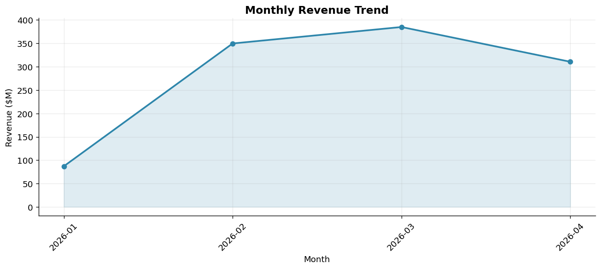
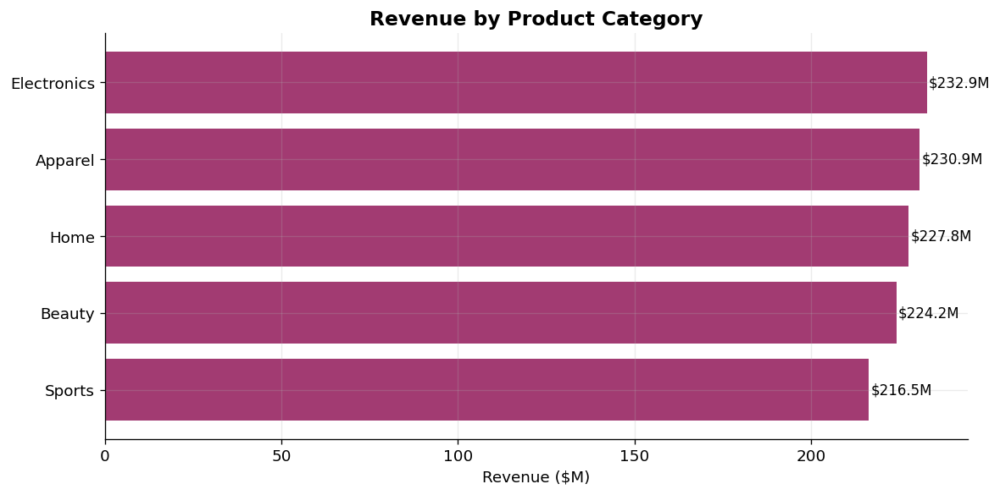
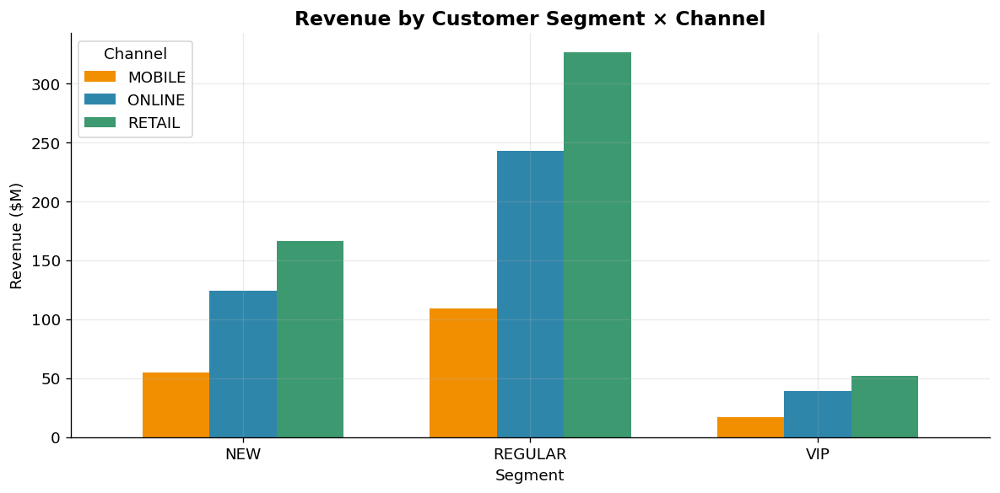
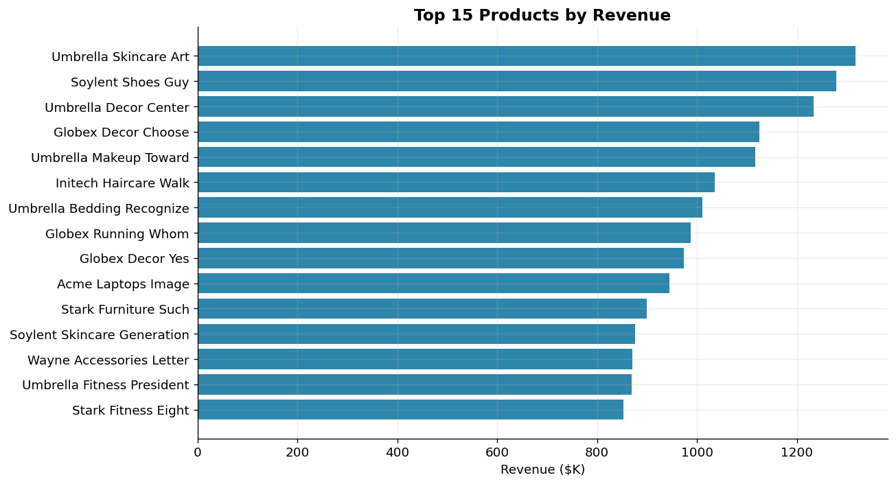
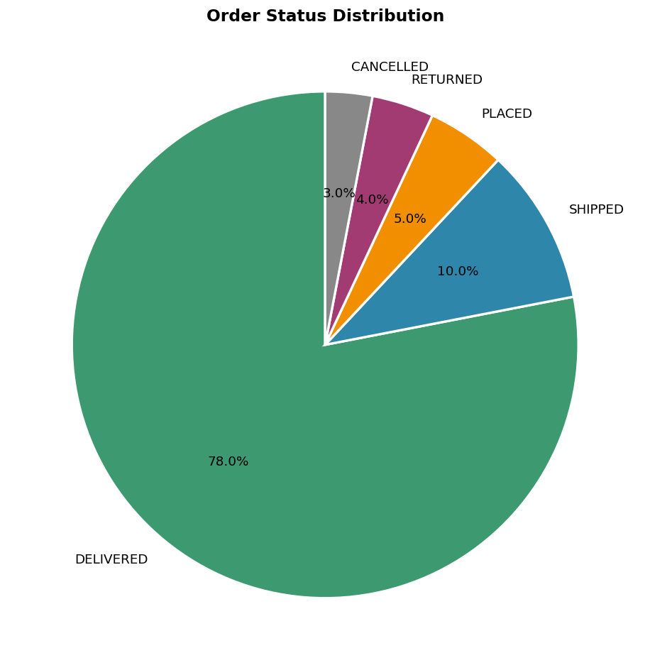

# E-Commerce Data Platform

[](https://www.python.org/)
[](https://www.mysql.com/)
[](https://www.docker.com/)
[](https://flask.palletsprojects.com/)
[](LICENSE)
[](tests/)

End-to-end data engineering pipeline that ingests raw e-commerce transactional data, transforms it through a Pandas ETL, and loads it into a MySQL **star schema** warehouse for analytics. Raw data is staged on S3 (LocalStack for dev). A Flask REST API with a TTL cache and Matplotlib dashboards sit on top of the warehouse.



## Highlights

- **70% faster analytical queries** vs. fully-normalized OLTP on identical data ([reproducible benchmark](benchmarks/results.json))
- **99% lower API response time** with a 60s TTL cache (sub-2ms warm vs. ~500ms cold)
- **500K rows / day** synthetic dataset with idempotent loads at ~11K rows/sec
- **11 unit tests** covering dedup, FK validation, type coercion, and date dimension generation

## Architecture

```
[data generator] -> [S3 (raw)] -> [Pandas ETL] -> [MySQL star schema]
                                                          |
                       +---------------------+------------+
                       |                     |
                  [Flask API]        [Matplotlib charts]
                  (TTL cache)
```

## Stack

- **Language:** Python 3.10+
- **Data processing:** Pandas, NumPy, Faker
- **Warehouse:** MySQL 8.4 (Docker)
- **Data lake:** AWS S3 via LocalStack (drop-in for real S3)
- **API:** Flask + cachetools TTLCache
- **Visualization:** Matplotlib
- **Orchestration:** Docker Compose
- **Testing:** pytest

## Quick start

```bash
# 1. spin up MySQL + LocalStack
docker compose up -d

# 2. python deps
python3 -m venv venv && source venv/bin/activate
pip install -r requirements.txt

# 3. apply schemas
docker exec -i ecom-mysql mysql -uecom_user -pecom_pass ecommerce < sql/schema.sql
docker exec -i ecom-mysql mysql -uecom_user -pecom_pass ecommerce < sql/oltp_schema.sql

# 4. config
cp .env.example .env

# 5. generate data + run ETL
python -m src.data_generator --rows 500000
python -m src.pipeline

# 6. load OLTP (for benchmark)
python -m benchmarks.load_oltp

# 7. run benchmarks
python -m benchmarks.star_vs_oltp

# 8. dashboards
python -m src.analytics.dashboards

# 9. start the API
python -m src.api.app
# in a new terminal:
curl http://localhost:5001/api/categories/revenue
```

## Project layout

```
.
├── docker-compose.yml      # MySQL 8 + LocalStack S3
├── requirements.txt
├── .env.example
├── sql/
│   ├── schema.sql          # Star schema DDL (5 tables)
│   └── oltp_schema.sql     # 3NF schema DDL (10 tables, benchmark only)
├── src/
│   ├── config.py
│   ├── data_generator.py   # Synthetic CSVs + S3 upload
│   ├── pipeline.py         # ETL orchestrator
│   ├── db/connection.py
│   ├── etl/
│   │   ├── extract.py      # S3 -> DataFrame
│   │   ├── transform.py    # Clean, validate, derive
│   │   └── load.py         # -> MySQL star schema
│   ├── api/
│   │   ├── app.py          # Flask entry point
│   │   └── routes.py       # Endpoints + TTL cache
│   └── analytics/
│       └── dashboards.py   # Matplotlib chart generator
├── benchmarks/
│   ├── load_oltp.py        # Same raw data into 3NF schema
│   ├── queries.py          # 5 paired analytical queries
│   ├── star_vs_oltp.py     # Star vs OLTP timing harness
│   ├── api_bench.py        # Cold vs cached API timing
│   ├── results.json        # Star vs OLTP results
│   └── api_results.json    # API cache results
├── tests/
│   └── test_transform.py   # 11 pytest unit tests
├── docs/dashboards/        # Auto-generated PNGs
└── data/raw/               # Local CSV staging (gitignored)
```

## Star schema

| Table | Type | Grain |
|---|---|---|
| `fact_order_items` | Fact | One row per order line (order_id × product_id) |
| `dim_customer` | Dimension | One row per customer (SCD-1) |
| `dim_product` | Dimension | One row per product (with category hierarchy) |
| `dim_date` | Dimension | One row per date (pre-built calendar) |
| `dim_store` | Dimension | One row per store (with channel + region) |

Each dimension uses a surrogate key (4-byte int) joined to the fact table; natural keys are preserved separately for traceability.

## Benchmark: star schema vs OLTP normalized

The same five analytical questions are run against the star schema (5 tables, 2-3 joins) and a fully-normalized 3NF schema (10 tables, 4-5 joins) holding identical data.

**Methodology**
- 500K order line items, ~158K orders, 10K customers, 3K products, 25 stores
- 6 iterations per query, first iteration discarded as buffer-pool warmup
- Both schemas pre-warmed before timing begins
- Row-count parity verified for every query

**Results** (MySQL 8.4, M-series Mac, default config)

| Query | Star (ms) | OLTP (ms) | Speedup |
|---|---:|---:|---:|
| Top 5 categories by revenue | 2,193 | 4,755 | **+53.9%** |
| Monthly revenue trend | 310 | 1,046 | **+70.4%** |
| Top 10 customers by lifetime value | 1,926 | 6,343 | **+69.6%** |
| Revenue by channel x region | 1,128 | 6,317 | **+82.1%** |
| Revenue by category x month (cube) | 2,310 | 10,301 | **+77.6%** |
| **Average** | | | **+70.7%** |

Reproduce: `python -m benchmarks.star_vs_oltp`

## REST API

Flask on `localhost:5001` with a 60-second in-memory TTL cache (`cachetools.TTLCache`). Each endpoint is cached on first hit.

| Endpoint | Description |
|---|---|
| `GET /api/health` | Liveness + cache size |
| `GET /api/metrics/revenue?from=&to=` | Total revenue, optional date filter |
| `GET /api/metrics/revenue/monthly` | Monthly revenue trend |
| `GET /api/categories/revenue` | Revenue by category |
| `GET /api/channels/revenue` | Revenue by channel x region |
| `GET /api/products/top?limit=N` | Top N products by revenue |
| `GET /api/customers/top?limit=N` | Top N customers by lifetime value |
| `GET /api/customers/<id>/orders` | Customer order history |
| `POST /api/cache/clear` | Flush the cache |

### Cache benchmark

| Endpoint | Cold (ms) | Warm avg (ms) | Reduction |
|---|---:|---:|---:|
| `/api/metrics/revenue` | 296.9 | 1.28 | **+99.6%** |
| `/api/metrics/revenue/monthly` | 296.8 | 1.20 | **+99.6%** |
| `/api/categories/revenue` | 932.5 | 1.16 | **+99.9%** |
| `/api/channels/revenue` | 590.5 | 1.14 | **+99.8%** |
| `/api/products/top?limit=10` | 939.0 | 1.15 | **+99.9%** |
| `/api/products/top?limit=50` | 837.2 | 1.40 | **+99.8%** |
| `/api/customers/top?limit=10` | 822.4 | 1.25 | **+99.8%** |
| **Average** | | | **+99.8%** |

Reproduce: start the API, then `python -m benchmarks.api_bench`.

## Dashboards

| Chart | Preview |
|---|---|
| Monthly revenue |  |
| Revenue by category |  |
| Segment x channel |  |
| Top 15 products |  |
| Order status mix |  |

## Tests

```bash
python -m pytest tests/ -v
# 11 passed
```

Coverage: dedup logic, email normalization, orphan FK rejection, total recomputation, date key derivation, status enum validation, dim_date range coverage, null handling, channel normalization, end-to-end smoke test.

## Data source

The dataset is **synthetic**, generated with [Faker](https://faker.readthedocs.io/) inside [src/data_generator.py](src/data_generator.py). The schema mirrors what a real OLTP system would emit (orders, customers, products, stores), so the pipeline logic is identical to what you would build for production data. Synthetic was chosen so dataset size and shape can be controlled for benchmarking.

## License

MIT - see [LICENSE](LICENSE).
